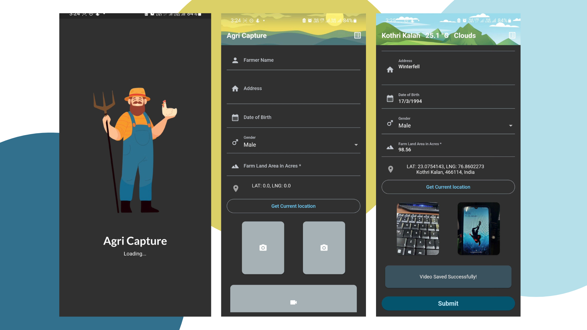
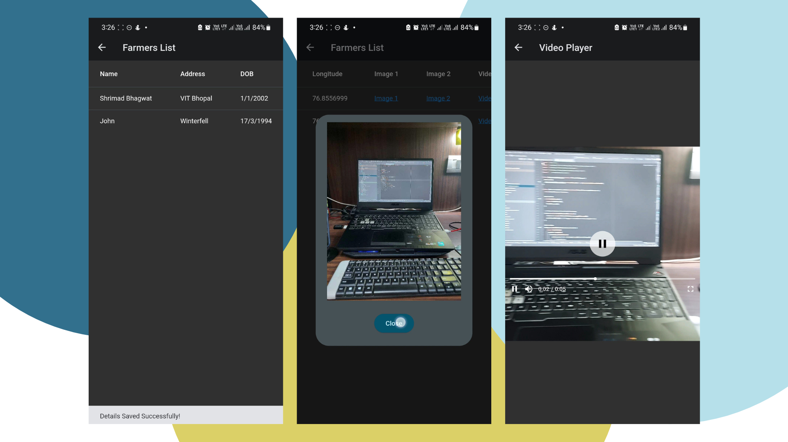

# Agri-Capture Mobile App 🚜🌾

## Overview
Agri-Capture a smart and user-friendly solution designed for both Android and iOS platforms. To revolutionize the way we collect and interact with data related to our farmers. 🌱✨

## Technologies Used

- **Flutter**

## Features

### Screen 1 - Farmer Data Collection 📝
1. **Farmer Name:** (Mandatory)
2. **Address:** (Optional)
3. **DOB:** Date of Birth
4. **Gender:** (Drop down)
5. **Farm Land Area in Acres:** Numeric input (not more than 100)
6. **Lat and Log:** Capture the location farm with GEO Tagging (Mandatory)
7. **2 Images:** Capture real-time images using camera (Mandatory)
8. **1 Video for 30secs:** Capture video of the farm (Mandatory)

#### Validations and Permissions
- **Smart Validation:** User-friendly validations for a seamless experience.
- **Permission Requests:** Request for Location, Camera, and Storage permissions.

### Screen 2 - Farmer Showcase 🌐🌾
- **Interactive Display:** Display collected farmer data in a  table/grid.
- **Multimedia Links:** Links for images and videos associated with each farmer record.
- **Comprehensive View:** Display all collected fields, including the ever-important latitude and longitude.

#### Bonus Task 🌞
- **Smart Weather Integration:** Fetch the current temperature and city of the device's location from an open-source API. Showcase the weather on top of the app

## Project Screenshots🚀

## Demo Video

## Results 🎉
The source code files for the Agri-Capture Mobile App have been successfully completed and organized within the respective branches of this repository. 

Additionally, the Android Application Package (APK) file for the Android version of the application has been prepared for your convenience. 

[Agri Capture APK Download](https://github.com/Shrimad-Bhagwat/Agri-Capture/releases/download/agri_capture-v1.0.0/agri_capture-v1.0.0.apk)

Let the farming adventure begin! 🚜✨
